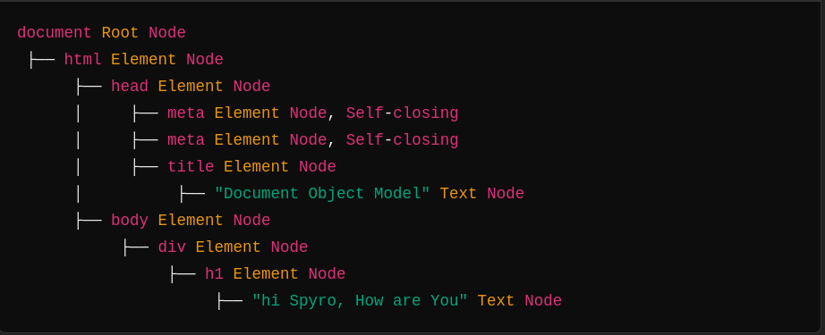

# WHAT IS DOM ?

- DOM stands for Document Object Model.
- DOM acts as an interface between javaScript and Browser.
- DOM is a tree like structure generated from an html document.
- DOCUMENT refers to the web page.
- OBJECT refers to the tags like DIV , SPAN , Paragarph.
- MODEL refers the structured representation of the document showing how elements relate to each other in tree format
- in DOM all elements are called as nodes.
- DOM can also be called as hierarchy of nodes.

# TYPES OF NODE IN DOM

- Doucment node (root node)
- Element node (div , span , paragraph)
- Text node (text inside elements)
- Comment node ( comments in the code )
- Attributes node ( id , title , class which are used inside elements )

# HOW DOM IS CREATED ?

- When you run your html code . browser loads the html page and parses the HTML file into tree like structure that is called DOM.
- while parsing the browser parses the html code from top to bottom.
- while parsing from top to bottom browser encounters different html elements , it converts those elements into nodes and organize them into a tree like structure.
- in DOM where all the html tags becomes a node in a tree.
- document object is a root node for the tree . document is the entry point of the DOM.

# HTML CODE BEFORE BROWSER LOADING IT (EX: 0.1)

```markdown
<html>
  <head>
    <title>Document Object Model</title>
  </head>
  <body>
    <div>
      <h1>hi Spyro , How are You</h1>
    </div>
  </body>
</html>
```

# DOM TREE REPRESENTATION (EX: 0.2)



- i think now you got some idea about how the dom is getting created
- in the first code i.e (EX 0.1) we have written html code.
- after browser runs it a dom tree is created for that HTML file that you can see as DOM TREE REPRESENTATION in the example (EX 0.2)
- you can code how much you want in the html file browser parses your html file into DOM tree.

# WHAT IS DOM MANIPULATION ?

- DOM manipulation is the process of dynamically changing the HTML structure , style , content usig javaScript. DOM allows javascript to access , modify , and remove elements from the DOM.

# WHAT CAN WE DO WITH DOM ?

- we can access HTML elements.
- modify the content of existing elements.
- we can add new elements to the dom.
- by using dom we can make the web page interactive using event Listeners.

# THEN HOW TO START MANIPULATION OF DOM ?

- To manipulate dom first we need to access the html elements that we need to modify.
- To access the elements we have some powerful methods given by DOM to manipulate the dom itself.
- Now we will learn about all those methods to how to use .

# THE METHODS TO SELECT ELEMENTS ARE.

- getElementById
- getElementsByClassName
- getElementsByTagName
- querySelector
- querySelectorAll

# getElementById

- getElementById is a method which is used to select an element using its ID attribute . remember ID's are unique
  for example : if a div has an ID attribute with the value of 'title' no other element in the file should have te same ID value,
  y because when ever you use getElementByID method to access element it will return you only on element.
- now we will see how to use this getElementByID method in our code.

# HTML CODE

- here for the DIV element we used ID attribute with the value "title"
- now in javascript file we will try to access this element

```javascript
<html>
  <head>
    <title>Document Object Model</title>
  </head>
  <body>
    <div id="title">Hello There</div>
  </body>
</html>
```

# JAVASCRIPT CODE

- here i used documnet.getElementById("title") method to access the element and stored it in the variable called container .
- you have to write the same ID value inside double quotes in the getElementByID method
- my ID value is "title" you can see that in html code i have used the same ID value inside the getElementById method to access the div element
- in the console you can see the element that you have accessed .

```javascript
const container = document.getElementById("title");
console.log(container);
```

# OUTPUT

```javascript
<div id="title">Hello There</div>
```

# NOW WE WILL ACCESS MULTIPLE ELEMENTS USING SAME METHOD

# HTML CODE

```javascript
<html>
  <head>
    <script defer src="script.js"></script>
    <title>Document Object Model</title>
  </head>
  <body>
    <div id="title">Hello IM DIV</div>
    <span id="greet">Hello im Span</span>
    <h1 id="text">GOOD MORNING</h1>
    <h2 id="message">GOOD NIGHT</h2>
  </body>
</html>
```

# JAVASCRIPT CODE

```javascript
const elementDiv = document.getElementById("title");
const elementSpan = document.getElementById("greet");
const elementH1 = document.getElementById("text");
const elementH2 = document.getElementById("message");

console.log(elementDiv);
console.log(elementSpan);
console.log(elementH1);
console.log(elementH2);
```

# OUTPUT

```javascript

    <div id="title">Hello IM DIV</div>
    <span id="greet">Hello im Span</span>
    <h1 id="text">GOOD MORNING</h1>
    <h2 id="message">GOOD NIGHT</h2>

```

# getElementsByClassName

- getElementsByClassName is one of the method given by DOM to select elements . here we select the element by using class attribute . getElementsByClassName can return more than one element so you can use same class name for different elements
- for ex: if 3 elements have same class name and you use getElementsByClassName this method to access it will return you all those 3 elements.
- now we will see this by coding

# HTML CODE

```javascript
<html lang="en">
  <head>
    <script defer src="script.js"></script>
    <title>Document Object Model</title>
  </head>
  <body>
    <div class="title">Hello IM DIV</div>
    <span class="greet">Hello im Span</span>
    <h1 class="text">GOOD MORNING</h1>
    <h2 class="message">GOOD NIGHT</h2>
  </body>
</html>
```

# JAVASCRIPT CODE

```javascript
const allElements = document.getElementsByClassName("title");
console.log(allElements);
```

# OUTPUT

```javascript

HTMLCollection(4) [div.title, span.title, h1.title, h2.title]
0
:
div.title
1
:
span.title
2
:
h1.title
3
:
h2.title
length
:
4
```

# getElementsByTagName

- getElementsByTagName is one of the method to access elements by using their Tag name itself
- for example if you want to get div element you just use the Tag name inside the method getElementsByTagName("div").
- if you want to access div by using its tag name and if there are multiple div's in the file it will return all the div's.
- now we will see this by coding.

# HTML CODE

```javascript
<!DOCTYPE html>
<html>
  <head>
    <script defer src="script.js"></script>
    <title>Document Object Model</title>
  </head>
  <body>
    <div>Hello IM DIV</div>
    <span>Hello im Span</span>
  </body>
</html>
```

# JAVASCRIPT CODE

```javascript
const gettingByTagName = document.getElementsByTagName("div");
console.log(gettingByTagName);
```

# OUTPUT

```javascript
HTMLCollection(2)[(div, div)];
```
